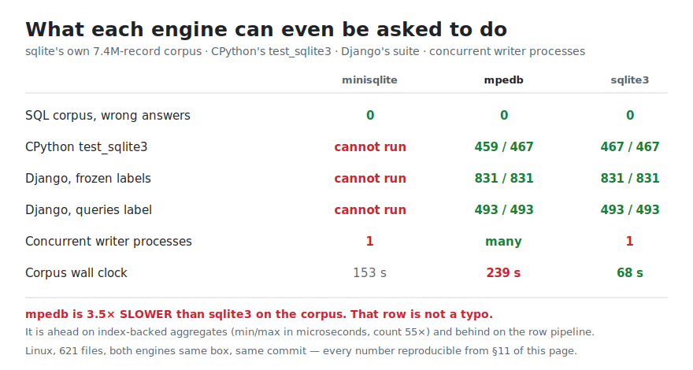

# minisqlite vs mpedb (incl. SQLite3 / PostgreSQL)

## Two SQL engines, one weekend, and the boring number nobody publishes



**mpedb runs Django and CPython's own `sqlite3` test suite. minisqlite cannot be
asked to.** Not "fails" — *cannot be asked*: it ships no C-API, so no Python
driver, no ORM, no `LD_PRELOAD`, nothing that speaks libsqlite3's ABI can reach
it. mpedb ships one, and through it Django's frozen labels pass **831/831** and
`queries` **493/493**, with CPython's suite at **459/467** — every remaining
failure a documented refusal, none a wrong answer.

Both engines answer sqlite's own **7.4-million-record** corpus with **zero wrong
answers**. That is the bar, and both clear it.

**And here is the row a launch post would leave out: mpedb is 3.5× SLOWER than
sqlite3 on that corpus** — 239 s against 68 s, same box, same commit, same files.
minisqlite sits between us at 153 s. We are ahead where an index can answer the
question (`min`/`max` in microseconds instead of 162 ms, `count(a)` 55× faster)
and behind on the per-row pipeline, because mpedb validates every decoded row
where sqlite memcpy's a record. That is a design choice with a bill, and the bill
is on this page.

One thing mpedb does that neither of the others can: **several OS processes
writing the same file at once**. In a survey of ~100 actively-maintained
open-source engines, three allow it ([`LANDSCAPE.md`](LANDSCAPE.md)).

*Cost, since it is being discussed: mpedb — engine, SQL front end, C-API shim,
mirror, CLI — was built inside a Claude Max 20× subscription, under half of it
used. Compare that against whatever a competing effort reports, and note which
one includes a C-API.*

**Everything above is reproducible from this page** — §11 for the corpus timings,
[`C-API-COMPAT.md`](C-API-COMPAT.md) for the suite runs test-by-test.

---

**Date:** 2026-07-21  
**minisqlite:** [github.com/cursor/minisqlite](https://github.com/cursor/minisqlite) @ `main`  
**mpedb:** this workspace @ `4926536`  
**Machines (minisqlite tests run on both):**
- **M3:** Apple M3 Pro, 11 cores, macOS 26.6 (Darwin 25.6.0) — unit, **sqllogictest**, cargo bench, micro
- **Linux:** AMD EPYC-Milan 2 cores, Linux 6.8 — unit, **sqllogictest**, cargo bench, micro  

**What is comparable without a C-API:** official **sqllogictest** corpus (SQL text in → results out).  
**What needs a C-API / host binding** (mpedb only here): CPython `test_sqlite3`, Django, SQLite TCL, TH3.  
**Own unit suites** are per-engine (cannot score minisqlite’s 5605 tests on mpedb or vice versa).

**SQLite / PostgreSQL / mpedb mpedb-bench numbers:** reused from `crates/mpedb-bench/RESULTS-macos-apple-m3-pro-11c.md` and `RESULTS-linux-amd-epyc-milan-2c.md` (not re-run)

**Update (2026-07-21 evening):** §10 re-runs the corpus + `:memory:` micro on both hosts at pinned commits — and documents an mpedb `:memory:` correctness regression at `e9acc83` found by that run. §1–§9 numbers below are the earlier same-day baseline, kept unchanged.

---

## 1. Short conclusion

| | **minisqlite** | **mpedb** | **stock SQLite 3.45** |
|---|---|---|---|
| Goal | Faithful SQLite reimplementation in Rust | Serverless file DB with **better concurrency** + rigid schema + modern features | Reference engine |
| On-disk format | **Full SQLite format 3** | Own format (+ SQLite attach/mirror) | format 3 |
| C-API / drop-in | ✗ | ✓ (`libmpedb_sqlite3`) | ✓ full |
| CPython / Django | **N/A** | 459/467 · A 831/831 · q 493/493 | stock baseline |
| Multi-process writers | ✗ | ✓ | single writer + WAL readers |
| Own unit suite | 5605/0 (M3 + Linux) | `cargo test --workspace` | — (TCL/TH3 not this doc) |
| **sqllogictest** 7.4M | 99.999882 % (4 wrong); ~187 s Linux / ~86 s M3 | 99.974859 % raw; ~318 s Linux / ~153 s M3 | 99.999933 % (3 wrong); ~70 s Linux |
| mpedb-bench speed cells | **N/A** (no adapter) | measured (RESULTS) | measured (RESULTS) |
| minisqlite micro (not CG) | §5.3 | — | — |

**Legend:** **N/A** = not possible for this engine · **—** = not measured this round · **✗** = absent / not supported.

**Choose minisqlite** if you want *“SQLite, but in Rust”* with byte-compatible files and a pure facade.  
**Choose mpedb** if you need C-API/Python/Django, multi-process writers, or stricter schema + mirror/RLS.

---

## 2. Product surface

| Property | minisqlite | mpedb | SQLite 3.45 | PostgreSQL 16 |
|---|---|---|---|---|
| Language | Rust | Rust | C | C |
| Public API | `Connection::{open, open_in_memory, execute, query}` | Rust facade + CLI + PyO3 + C-shim | C-API + bindings | Client/server |
| Prepared statements | ✗ | ✓ | ✓ | ✓ |
| C-API / `libsqlite3` drop-in | ✗ | ✓ (~50 symbols) | ✓ full | N/A (libpq) |
| File format | SQLite format 3 bidirectional | Own `.mpedb` (+ SQLite attach/mirror) | format 3 | own |
| Multi-process write | ✗ | ✓ | single writer + WAL readers | ✓ (server) |
| Concurrent readers | in-process WAL | multi-process lock-free | multi-process WAL | multi |
| Schema | SQLite-permissive | Rigid (fail early) | Permissive | Strong |
| FK / AUTOINCREMENT | ✓ | honesty-refusal | ✓ | ✓ |
| FTS | ✓ (SQLite-style) | FTS5 native | ✓ | ✓ |

---

## 3. Coverage: portable vs C-API suites

### 3.0 Which suites apply to whom

| Suite | Needs C-API? | stock SQLite | minisqlite | mpedb | PostgreSQL |
|---|---|---|---|---|---|
| Own unit / integration suite | No (per engine) | — (TCL/TH3 not re-run) | **5605/0** | `cargo test --workspace` | — |
| Official **sqllogictest** corpus | No | §3.2 | §3.2 | CORPUS-STATUS | N/A (SQLite dialect) |
| CPython `test_sqlite3` | Yes | stock baseline | **N/A** | **459/467** | N/A |
| Django frozen A | Yes | via pysqlite | **N/A** | **831/831** | — |
| Django `queries` | Yes | via pysqlite | **N/A** | **493/493** | — |
| SQLite TCL suite | Yes | ✓ | **N/A** | **N/A** | N/A |
| TH3 | proprietary | ✓ (SQLite only) | **N/A** | **N/A** | N/A |

### 3.1 Own unit suites (not cross-engine)

These are **implementation tests**, not a shared scoreboard. minisqlite’s 5605 tests call its Rust facade (and crate internals); they cannot be pointed at mpedb or libsqlite3 without a rewrite. mpedb’s suite likewise.

| Engine | Command | Result |
|---|---|---|
| **minisqlite** M3 | `cargo test --workspace --release` | **5605 passed, 0 failed** (`minisqlite-test-m3.log`) |
| **minisqlite** Linux | same | **5605 passed, 0 failed** (`minisqlite-test-linux.log`) |
| **mpedb** | `cargo test --workspace` | continuous CI / local (this tree) |
| **stock SQLite** | TCL suite / TH3 | not re-run in this document |

minisqlite suite makeup (for scale): ~2964 facade `conformance_*.rs` tests (SQL vs sqlite.org-transcribed expects) + format/durability fixtures + per-crate unit tests + seams.

### 3.2 Official **sqllogictest** corpus (no C-API — fair multi-engine)

| Field | Value |
|---|---|
| Corpus | [grahn/sqllogictest](https://github.com/grahn/sqllogictest) `test/**/*.test` |
| Files | **621 / 622** (`select5.test` excluded — same as mpedb [CORPUS-STATUS.md](design/CORPUS-STATUS.md)) |
| Harness (this round) | same SLT parser + MD5 + I/R/T rendering; engines answer as `sqlite` in `skipif`/`onlyif` |
| stock SQLite | rusqlite **bundled 3.45.0** (`sqlite_corpus`) — Linux |
| minisqlite | `minisqlite_corpus` — **M3 + Linux** (identical totals) |
| mpedb | `mpedb-testkit` `sqlite_corpus --as-sqlite` + schema shim; **size_mb=32** (default after harness tweak; 16 OOM’d some files) |

**Headline (same 621 files, same flist):**

| metric | **stock SQLite 3.45** (Linux) | **minisqlite** (M3 ≡ Linux) | **mpedb** (Linux ≡ M3, size_mb=32) |
|---|---:|---:|---:|
| records seen | 7 419 277 | 7 419 277 | 7 419 277 |
| skipped | 1 480 834 | 1 480 834 | 1 480 834 |
| **attempted** | 5 938 443 | 5 938 443 | 5 938 443 |
| **passed** | 5 938 439 — 99.999933 % | 5 938 436 — 99.999882 % | 5 936 950 — 99.974859 % |
| ├ statements | 210 082 | 210 080 | 208 759 |
| └ queries | 5 728 357 | 5 728 356 | 5 728 191 |
| wrong answers | 3 | 4 | 7 (runner flags; CORPUS-STATUS for genuine vs shim) |
| error mismatches | 0 | 2 | 0 |
| refused / unsupported | 0 | 0 | 1 486 (mostly shim) |
| **wall clock** | **~70 s** (Linux) | **~86 s** M3 · **~187 s** Linux | **~153 s** M3 · **~318 s** Linux |

mpedb pass counts **identical** Linux↔M3 at size_mb=32. Wall-clock is still dominated by per-statement `prepare_detached` (not open size: 16 vs 32 vs 128 almost same speed; 16 was wrong for capacity). Prior CORPUS-STATUS M3: 0 genuine wrong after shim discount.

**Shared residual (harness / extreme floats):** stock SQLite and minisqlite both miss the same 3 `evidence/slt_lang_aggfunc.test` cases — `sum`/`total` on extreme i64 rendered with `%.3f` vs corpus text (`…5808` vs `…6000`). That is **not** a minisqlite-only bug.

**minisqlite-only extras vs stock SQLite (same harness):**

| delta | detail |
|---|---|
| +1 wrong | `random/…/slt_good_121.test` — `SELECT DISTINCT *` cross join, 81 values, MD5 mismatch |
| +2 errmis | expected-error vs success in the same aggregate edge area |
| same 1 engine error | `sum(x)` integer overflow where corpus expects a Real (also fails on stock with this harness path) |

**mpedb:** lower raw pass% mainly from **schema shim** (no free `CREATE TABLE` in the seed model) and a small set of engine gaps; after discounting runner artifacts, CORPUS-STATUS reports **zero genuine wrong answers**. Not directly comparable to the native-DDL harness used for minisqlite/sqlite3.

**PostgreSQL:** the public sqllogictest corpus is SQLite-dialect; we do **not** claim a PG score here (mpedb uses a separate 3-way differential generator for PG, not this corpus).

### 3.3 C-API host suites

| Suite | minisqlite | mpedb | stock SQLite |
|---|---|---|---|
| CPython `test_sqlite3` | **N/A** | **459/467** | 467/467 stock |
| Django frozen A | **N/A** | **831/831** | via pysqlite |
| Django `queries` | **N/A** | **493/493** | via pysqlite |
| `libsqlite3` ABI | **✗** | ✓ `libmpedb_sqlite3` | ✓ full |

CPython residual (mpedb): progress + non-goals — [C-API-COMPAT.md](C-API-COMPAT.md).

---

## 4. Speed — mpedb-bench RESULTS (+ minisqlite column)

**Legend:** **N/A** = not possible · **—** = not in this harness / not measured · numbers without mark = mpedb-bench control group (RESULTS 2026-07-21, not re-run).

minisqlite has **no mpedb-bench adapter** (no prepare, no multi-process). Control-group cells are **N/A**. Directional string-SQL micro (not CG) is in §5.3 only — do not rank it against prepared paths.

### 4.1 Apple M3 Pro (`RESULTS-macos-apple-m3-pro-11c.md`)

**none-class** (tmpfs/ramdisk, no fsync guarantee):

| Cell | mpedb | SQLite 3.45 | PostgreSQL 16 | Turso 0.7 | minisqlite |
|---|---:|---:|---:|---:|---:|
| point-insert ops/s | **233 477** | 117 077 | 33 470 | 47 023 | **N/A** |
| point-select ops/s | **1 263 331** | 325 857 | 40 773 | 236 345 | **N/A** |
| contended-writes ops/s | **144 620** | 101 173 | 116 121 | 41 029 | **N/A** |

**durable-on-ack batched** (100 rows/commit, disk, fullfsync/WAL):

| Engine | ops/s |
|---|---:|
| **mpedb** (wal) | **28 126** |
| SQLite FULL+WAL | 27 261 |
| PostgreSQL sc=on | 13 789 |
| minisqlite | **N/A** |
| Turso | — |

**M3 multi-run** (7× interleaved, seed-once, mpedb-bench only):  
median **mpedb 29 748** > **SQLite 28 540** > **PG 13 600** (6/7 wins).  
minisqlite: **N/A**.

### 4.2 Linux 2-core EPYC (`RESULTS-linux-amd-epyc-milan-2c.md`)

| Cell | mpedb | SQLite | PostgreSQL | minisqlite |
|---|---:|---:|---:|---:|
| point-insert (none) | **186 956** | 42 199 | 14 217 | **N/A** |
| point-select (none) | **437 232** | 81 375 | 19 940 | **N/A** |
| contended-writes (none) | **125 397** | 35 033 | 37 574 | **N/A** |
| durable batched | **27 700** | 12 001 | 10 156 | **N/A** |

Sources: committed RESULTS. minisqlite directional micro (not CG): §5.3.

---

## 5. Speed — minisqlite measured (detail)

### 5.1 Own `cargo bench` — M3 (2026-07-21 re-run, through 1M)

Source: `~/mpedb-measure-results/minisqlite-bench-m3.log`

```text
scalability (wall-clock ms / peak heap KiB), sizes [1000, 10000, 100000, 1000000]
workload                              1000             10000            100000           1000000
point_lookup_indexed            0.6ms/123K       0.0ms/4554K      0.1ms/11886K     0.7ms/119426K
range_scan                      0.1ms/125K       0.1ms/4555K      0.8ms/11881K     7.4ms/119364K
equi_join                       0.4ms/558K       2.9ms/6960K     27.9ms/33122K   278.1ms/322757K
group_by                        0.3ms/129K       1.5ms/4559K     15.1ms/11885K   152.4ms/119368K
correlated_subquery             1.8ms/132K      17.9ms/4562K    178.8ms/11889K  1775.8ms/119372K

durability round-trip (commit survives reopen, rollback leaves no trace): ok
```

### 5.2 Own `cargo bench` — Linux EPYC 2c

Source: `~/mpedb-measure-results/minisqlite-bench-linux.log`

```text
scalability (wall-clock ms / peak heap KiB), sizes [1000, 10000, 100000, 1000000]
workload                              1000             10000            100000           1000000
point_lookup_indexed            0.1ms/123K       0.1ms/4554K      0.5ms/11886K     3.2ms/119426K
range_scan                      0.2ms/125K       0.4ms/4555K      2.6ms/11881K    29.7ms/119364K
equi_join                       1.5ms/558K      11.9ms/6960K     98.9ms/33122K  1199.9ms/322757K
group_by                        0.6ms/129K       4.0ms/4559K     45.4ms/11885K   445.6ms/119368K
correlated_subquery             5.1ms/132K      52.7ms/4562K    571.4ms/11888K  4786.7ms/119372K

durability round-trip (commit survives reopen, rollback leaves no trace): ok
process peak RSS: 367664 KiB
```

This is **scalability / plan-shape**, not the same cells as mpedb-bench (no shared harness). M3 is ~3–4× faster than the 2-core Linux host on the large sizes (as expected).

### 5.3 Microbench (same logical schema as mpedb-bench `users` table)

API: string-SQL per call (no prepare) — **unfavorable vs mpedb/SQLite prepared path**.

**M3 (2026-07-21 re-run)** — `minisqlite-micro-m3.log`:

| Cell | minisqlite (M3) | mpedb (RESULTS M3) | SQLite (RESULTS M3) |
|---|---:|---:|---:|
| In-memory point-insert | ~262 k ops/s (n=50k) | ~233 k (none tmpfs) | ~117 k |
| Disk point-select (WAL) | ~235 k ops/s (n=20k) | **~1.26 M** (none) | ~326 k |
| Disk WAL batch 100/commit FULL | ~5.0 k rows/s (n=10k) | **~28 k** durable | ~27 k durable |

**Linux EPYC 2c** — `minisqlite-micro-linux.log`:

| Cell | minisqlite (Linux) | mpedb (RESULTS Linux) | SQLite (RESULTS Linux) |
|---|---:|---:|---:|
| In-memory point-insert | ~83 k ops/s (n=50k) | ~187 k (none) | ~42 k (none) |
| Disk point-select (WAL) | ~160 k ops/s (n=20k) | ~437 k (none) | ~81 k (none) |
| Disk WAL batch 100/commit FULL | ~22 k rows/s (n=10k) | ~28 k durable | ~12 k durable |

**Interpretation:** minisqlite is a serious SQLite clone. It **lacks a prepare hot path** and **multi-process**. M3 durable batch is fsync-bound (~5k rows/s FULL); Linux batch looks stronger relative to stock SQLite on that host. Micro is **not** control-group-identical to mpedb-bench.

### 5.4 Fair in-memory prepare+bind (Linux + M3, `7fb0d53`, 2026-07-21)

Same schema `users(id PK, name, age)`, n=50k, batch=100. mpedb `path = ":memory:"` (private memfd / unlinked temp, durability=none); minisqlite/sqlite3 `open_in_memory()`. Harness: external `imem_bench` (not in-tree).

| Cell | **Linux** mpedb | Linux sqlite3 | **M3** mpedb | M3 sqlite3 | mpedb/sqlite (L · M3) |
|---|---:|---:|---:|---:|---|
| prepare+bind **SELECT** (`execute(hash)`) | 1.34 M (0.7 µs) | 2.51 M (0.4 µs) | 1.94 M (0.5 µs) | 3.77 M (0.3 µs) | 0.53× · 0.51× |
| **PreparedSelect** (sqlite-stmt analogue) | **1.78 M** (0.6 µs) | = bind above | **2.55 M** (0.4 µs) | = bind above | **0.71× · 0.68×** |
| prepare+bind **INSERT** (autocommit) | **460 k** (2.2 µs) | 1.16 M (0.9 µs) | **564 k** (1.8 µs) | 1.51 M (0.7 µs) | 0.40× · 0.37× |
| batch-100 prepare INSERT | **891 k rows/s** | 634 k (string) | **1.57 M** | 1.24 M (string) | **wins · wins** |
| string SELECT (re-parse) | 182 k | 468 k | 281 k | 932 k | loses (parse tax) |
| string INSERT (re-parse) | 150 k | 476 k | 192 k | 835 k | loses |
| minisqlite prepare | **N/A** | | **N/A** | | no prepare API |

**Linux before this hot-path work** (same harness, earlier same day): prepare+bind SELECT **463 k**, INSERT **269 k** → SELECT ~**3.8×** via PreparedSelect, INSERT ~**1.7×**.

**What closed the gap:**

1. Private-memory reader pins + process-local meta double-buffer  
2. PkPoint micro-executor + stack Int-PK encode + projected `get_by_pk_cols`  
3. **`PreparedSelect`** + TLS last-plan cache  
4. Private exclusive **in-place** leaf mutation when no concurrent pins (undo buffer for abort)

**Honest residual:** PreparedSelect is still ~0.7× stock SQLite (owned `Value`/`String` + pin per call vs VDBE registers). Autocommit INSERT ~0.4× (catalog/freelist/undo vs pure in-place B-tree). **Batch amortizes commit and beats sqlite string-batch on both hosts.** Prefer `prepare_select` + `execute_prepared_select` for reads and multi-row `WriteSession` for writes.

Sources: `~/mpedb-measure-results/imem-bench-linux-post-push.log`, `imem-bench-m3-7fb0d53.log`. Plan notes: [design/notes/SELECT-HOTPATH-PLAN.md](design/notes/SELECT-HOTPATH-PLAN.md).
---

## 6. Architecture (brief)

### minisqlite
- 14 crates, ~200k LOC, almost no deps (`elsa` for page cache), **no unsafe** in library code (per README).
- Volcano executor, COW pager, rollback + WAL, format 3 codec.
- Concurrency: **in-process** multi-connection; **not** multi-process safe.

### mpedb
- SHM multi-process, meta double-buffer, freelist fixpoint, intent-ring group commit, durability `none|commit|wal|async`.
- SQL → content-hashed plans; rigid schema; C-API shim; mirror to SQLite/PG; RLS/UDF/FTS5, etc.

---

## 7. What was *not* done this round

- Re-bench of mpedb/SQLite/PostgreSQL (used committed RESULTS + existing M3 multi-run).
- CPython/Django against minisqlite (impossible without C-API) — correctly **N/A**, not a fail.
- Porting minisqlite’s 5605 Rust unit tests onto mpedb/sqlite3/PG (wrong tool; use sqllogictest for shared SQL).
- SQLite TCL suite / TH3 (C-API / proprietary).
- Full sqllogictest on **PostgreSQL** (dialect mismatch).
- Shared mpedb-bench adapter for minisqlite (API too small: no prepare).
- DuckDB / rest of LANDSCAPE.
- `select5.test` (excluded for all engines in this headline).

---

## 8. Recommendation

| Need | Recommendation |
|---|---|
| Byte-compatible SQLite file in pure Rust, single-process | **minisqlite** |
| Drop-in for Python/Django / libsqlite3 | **mpedb** |
| Multiple OS processes writing concurrently | **mpedb** |
| Maximum SQL/surface fidelity to stock SQLite (FK, AUTOINCREMENT, …) | **minisqlite** or **SQLite** |
| Portable logic corpus (sqllogictest) fidelity | **both very high**; minisqlite slightly higher raw % (native DDL) |
| Production throughput (none-class / multi-reader) | **mpedb** (measured) |
| “Just a file” + server (sc=on) | **PostgreSQL** only if you need the server model |

---

## 9. Reproduction

### 9.1 minisqlite unit + own bench

```bash
git clone https://github.com/cursor/minisqlite.git
export CARGO_TARGET_DIR=~/minisqlite-target
cd minisqlite
cargo test --workspace --release   # 5605 pass
cargo bench --bench workloads      # scalability harness (incl. 1M on Linux)
```

### 9.2 Official sqllogictest against minisqlite

```bash
git clone https://github.com/grahn/sqllogictest.git ~/sqllogictest
# external runner used this round: answers as engine `sqlite`, MD5 hash blocks
# (see host path ~/minisqlite-slt — not vendored in mpedb)
find ~/sqllogictest/test -name '*.test' | sort | grep -v '/select5\.test$' > flist-621
# run in chunks; aggregate TOTAL lines → attempted / passed / wrong
```

### 9.3 Artifacts

**M3 (2026-07-21, complete — no leftover processes):**
- `~/mpedb-measure-results/minisqlite-test-m3.log` — unit **5605/0**
- `~/mpedb-measure-results/minisqlite-corpus-m3.log` — 621-file sqllogictest, `DONE 2026-07-21T15:43:24+02:00` (~86 s)
- `~/mpedb-measure-results/minisqlite-bench-m3.log` — cargo bench through 1M
- `~/mpedb-measure-results/minisqlite-micro-m3.log` — micro insert/select/batch

**Linux (same day):**
- `~/mpedb-measure-results/minisqlite-test-linux.log` — unit 5605/0
- `~/mpedb-measure-results/minisqlite-corpus-linux.log` — same residual as M3 (~187 s)
- `~/mpedb-measure-results/sqlite-corpus-linux.log` — stock SQLite 3.45.0 same 621-file corpus (~70 s)
- `~/mpedb-measure-results/mpedb-corpus-linux-v3.log` — mpedb size_mb=32 (**~318 s** wall)
- `~/mpedb-measure-results/mpedb-corpus-m3-v3.log` — mpedb size_mb=32 (**~153 s** wall)
- `~/mpedb-measure-results/minisqlite-bench-linux.log`
- `~/mpedb-measure-results/imem-bench-linux-post-push.log` — fair `:memory:` micro @ `7fb0d53` (§5.4)
- `~/mpedb-measure-results/imem-bench-m3-7fb0d53.log` — same harness on M3
- `~/mpedb-measure-results/minisqlite-micro-linux.log`

**mpedb RESULTS (reused):**
- `crates/mpedb-bench/RESULTS-macos-apple-m3-pro-11c.md`
- `crates/mpedb-bench/RESULTS-linux-amd-epyc-milan-2c.md`
---

## 10. Re-run 2026-07-21 evening — all three engines, both hosts, pinned commits

**Pins (stated for every number below):** mpedb **`e9acc83`** (main, both hosts, rsync-verified on M3) · minisqlite **`4a5c134`** (`main`, both hosts) · stock SQLite **3.45.0** (rusqlite `0.31` bundled, same lockfile both hosts). Same 621-file flist and the same 16-chunk split as §3.2/§9.2 (chunk lists byte-identical to `minisqlite-flist-621`). Sequential, one engine at a time, nothing else on the box; Linux runs under `ulimit -v 3000000`. Two runs per engine per host; both reported, never averaged.

### 10.1 Headline first: an mpedb correctness regression at `e9acc83`, found by this run

The mpedb corpus run at `e9acc83` is **not byte-consistent with the §3.2 baseline** — identically on both hosts (deterministic, r1 ≡ r2 ≡ Linux ≡ M3):

| aggregate | baseline (§3.2, `214bd48`+WIP) | `e9acc83` |
|---|---:|---:|
| passed | 5 936 950 (99.974859 %) | 5 924 507 (99.765326 %) |
| statements passed | 208 759 | 205 413 |
| unsupported/refused | 1 486 | 4 975 |
| runner-flagged wrong | 7 | **8 960** |

**Root cause (bisected):** `INSERT INTO tabN SELECT * FROM tab0` fails with
`internal error (bug in mpedb): freelist fixpoint did not converge` (commit.rs §4.5 iteration cap) on delete-heavy `:memory:` databases. Every one of the 164 sampled wrong answers carries the runner's cascade note — the "wrong" queries read tables left empty by the refused INSERTs; the corpus flags ~8 960 of them.

- **Repro:** `sqlite_corpus --as-sqlite --size-mb 32 --samples-all ~/sqllogictest/test/index/delete/100/slt_good_0.test` → 145 × fixpoint refusals, 773 cascade wrongs, single process, single file.
- **Bisect:** `7fb0d53` (perf: `:memory:` fast path, PreparedSelect, **private in-place writes**) reproduces byte-identically; its parent window does not (the §3.2 baseline ran the same day's pre-in-place tree). Disabling only `Shm::try_begin_exclusive_write` (one line) on top of `e9acc83` → **0 fixpoint errors, 0 wrongs** on the repro file and a full corpus run byte-consistent with baseline (§10.2). Culprit is the **in-place exclusive-write path**, not PreparedSelect/TLS/PkPoint.
- **Blast radius:** `try_begin_exclusive_write` requires `is_private` — **only private `:memory:` databases** are exposed; file databases never take the in-place path. Failure mode is a refused commit (txn error), not corruption; abort/undo held in every observed case.
- **Mechanism (hypothesis, unverified):** in-place adoption dirties committed pages without the alloc/free the §4.5 termination argument counts on; under freelist churn (DELETE-heavy files) the fixpoint's plan keeps moving until the 64-iteration cap. The fix belongs in commit-path review (DESIGN.md §4.5) — e.g. forcing pure COW while `in_freelist_op` — and is **not attempted here**.
- **CLOSED (fix landed after this run):** the hypothesis was confirmed in the direction it pointed but the guessed shape ("COW while `in_freelist_op`") is *insufficient* — the observed failure is a period-2 plan oscillation whose cycle also closes with a fixpoint-*allocated* (never adopted) node when `freed` is empty. Actual fix: `WriteTxn::free` inters every fixpoint-time free in `freed` instead of recycling it into `reusable` (DESIGN.md §4.5, restated in `engine/freelist.rs`). In-place stays on, including for the freelist tree. Repro file and full corpus re-verified byte-consistent with the probe arm; regression test `crates/mpedb/tests/inplace_fixpoint.rs`.

Consequence for this document: the `e9acc83` mpedb corpus wall-clocks in §10.2 are printed for the record but **struck as invalid** — a timing from a run that got answers wrong is worthless. The valid mpedb corpus timing this round is the probe row (`e9acc83` + the one-line in-place disable), which is pass-rate-byte-identical to baseline.

### 10.2 Corpus wall clock (621 files, 5 938 443 attempted records)

Same-host pairs only; never compare a Linux number to an M3 number.

**Linux (AMD EPYC-Milan 2c):**

| engine | commit | r1 | r2 | passed | flagged wrong |
|---|---|---:|---:|---:|---:|
| stock SQLite 3.45.0 | rusqlite bundled | **69.5 s** | **67.6 s** | 5 938 439 (99.999933 %) | 3 |
| minisqlite | `4a5c134` | **153.2 s** | **153.0 s** | 5 938 436 (99.999882 %) | 4 (+2 errmis) |
| mpedb | `e9acc83` | ~~262.4 s~~ | ~~263.0 s~~ | ~~5 924 507~~ **invalid** (§10.1) | ~~8 960~~ |
| mpedb | `e9acc83` + in-place off (probe) | **258.9 s** | **262.8 s** | 5 936 950 (99.974859 %) | 7 (0 genuine) |

**M3 (Apple M3 Pro 11c):**

| engine | commit | r1 | r2 | passed | flagged wrong |
|---|---|---:|---:|---:|---:|
| stock SQLite 3.45.0 | rusqlite bundled | **41.6 s** | **41.8 s** | 5 938 439 (99.999933 %) | 3 |
| minisqlite | `4a5c134` | **85.2 s** | **84.9 s** | 5 938 436 (99.999882 %) | 4 (+2 errmis) |
| mpedb | `e9acc83` | ~~145.4 s~~ | ~~144.9 s~~ | ~~5 924 507~~ **invalid** (§10.1) | ~~8 960~~ |
| mpedb | `e9acc83` + in-place off (probe) | **146.9 s** | **146.7 s** | 5 936 950 (99.974859 %) | 7 (0 genuine) |

Correctness notes:
- sqlite and minisqlite aggregates are **byte-identical to §3.2** on both hosts and across both runs (same 3/4 wrongs, same 2 minisqlite errmis, same shared `slt_lang_aggfunc` float-rendering residual).
- The probe rows match baseline pass counts exactly; one record migrated failure category (unsupported 1486→1485, errmis 0→1), identical on both hosts: `slt_lang_reindex.test:40` — `REINDEX tXiX`. mpedb now *accepts* REINDEX (baseline refused all REINDEX as index-ddl) but does not error on an unknown index name, where sqlite does. A one-record follow-up gap, not noise.
- minisqlite on Linux measured 153 s vs ~187 s in §3.2 with the **same binary** (built 13:31); the §3.2 number was taken on a busier box. Prefer this round's paired numbers.

### 10.3 Movement vs the ~318 s / ~153 s baseline, attributed

mpedb corpus (valid probe rows): Linux 317.5 → **258.9/262.8 s** (−~18 %), M3 ~153 → **146.9/146.7 s** (−~4 %). The named suspects `dac2ada` (streaming aggregate), `6683dd0` (column pruning) and `e277644` (registry scan) are **already inside the §3.2 baseline** (all predate `214bd48`); they explain none of this movement. The whole delta sits in `214bd48..e9acc83`, i.e. essentially `7fb0d53` minus the broken in-place path:

1. the runner's per-statement path went `prepare_detached`/`execute_detached` → `query_once` (skips the canonical-bytes encode + fully re-validating decode per statement; ~210 k statements, ~100 k distinct compiles). Partly a **harness** change — but it makes the comparison *more* apples-to-apples, since the sqlite/minisqlite runners never paid an encode/decode tax;
2. PkPoint micro-executor, TLS last-plan cache, PreparedSelect (engine, `7fb0d53`).

The in-place write path contributed nothing valid here (its corpus effect at `e9acc83` is the §10.1 regression).

The asymmetry (−18 % on the 2-core EPYC, −4 % on the M3) says the per-statement encode/decode tax was mostly a slow-x86 cost; §3.2's "dominated by per-statement `prepare_detached`" held for Linux, much less for M3.

### 10.4 `:memory:` micro (imem_bench, §5.4 harness byte-identical on both hosts, n=50k, batch=100)

All numbers `e9acc83` (mpedb) / `4a5c134` (minisqlite) / bundled 3.45.0 (sqlite3); r1 / r2 per host.

**Linux:**

| cell | mpedb | minisqlite | sqlite3 |
|---|---:|---:|---:|
| string INSERT | 153 k / 109 k | 213 k / 178 k | 477 k / 392 k |
| prepare+bind INSERT | 471 k / 444 k | N/A | 959 k / 937 k |
| string SELECT | 181 k / 186 k | 277 k / 266 k | 481 k / 468 k |
| prepare+bind SELECT | 1.401 M / 1.400 M | N/A | 2.518 M / 2.561 M |
| **PreparedSelect** | **1.653 M / 1.810 M** | N/A | = bind |
| batch-100 INSERT rows/s | **951 k / 941 k** | 233 k / 220 k | 656 k / 655 k |

**M3:**

| cell | mpedb | minisqlite | sqlite3 |
|---|---:|---:|---:|
| string INSERT | 183 k / 195 k | 328 k / 323 k | 799 k / 797 k |
| prepare+bind INSERT | 524 k / 520 k | N/A | 1.447 M / 1.436 M |
| string SELECT | 270 k / 268 k | 423 k / 426 k | 913 k / 909 k |
| prepare+bind SELECT | 1.851 M / 1.781 M | N/A | 3.738 M / 3.726 M |
| **PreparedSelect** | **2.375 M / 2.289 M** | N/A | = bind |
| batch-100 INSERT rows/s | **1.545 M / 1.569 M** | 352 k / 344 k | 1.227 M / 1.233 M |

vs §5.4 (`7fb0d53`, same harness): mpedb PreparedSelect eased ~5–8 % (1.78→1.65/1.81 M Linux, 2.55→2.38/2.29 M M3) and prepare+bind INSERT ~4–8 % (M3 564→524/520 k) — consistent with `cc77c88`'s TLS-cache `conn_id` identity check (a deliberate containment fix on the hot path). Ratios to sqlite3 are unchanged in shape: PreparedSelect ~0.6–0.7×, autocommit INSERT ~0.4×, batch-100 **wins on both hosts** (Linux 951/941 k vs 656/655 k; M3 1.55/1.57 M vs 1.23 M). sqlite3's own prepare+bind INSERT also measured lower than §5.4 on Linux (959/937 k vs 1.157 M — same binary pin; box-day variance cuts both ways).

**Caveat:** the mpedb INSERT-side cells ride the private in-place write path — the same code carrying the §10.1 fixpoint bug (sequential-insert workloads don't trip it). Re-measure after the fix; the fix may cost part of the 274 k→470 k autocommit gain.

### 10.5 Artifacts (this round)

Linux `~/mpedb-measure-results/`: `sqlite-corpus-linux-e9-r{1,2}.log`, `minisqlite-corpus-linux-e9-r{1,2}.log`, `mpedb-corpus-linux-e9-r{1,2}.log` (invalid, kept as the regression record), `mpedb-corpus-linux-e9-noinplace-r{1,2}.log`, `imem-bench-linux-e9acc83-r{1,2}.log`.
M3 `~/mpedb-measure-results/`: same names with `m3`; plus `flist-621-m3` / `m3ck_*` (chunk split, byte-order-identical to the Linux lists).
Repro/probe: worktree `e9acc83` + one-line `try_begin_exclusive_write` disable (not committed anywhere; reproduce with the §10.1 repro line).

## 11. Update 2026-07-22 — mpedb at HEAD: the first valid post-fix number, and it dropped

§10's mpedb corpus row was struck invalid (the §10.1 `:memory:` fixpoint
regression). That bug was fixed at `31cb87c` (§4.5 fixpoint-time frees are
interred, never recycled), and a window of aggregate/join perf work landed on
top of it. This is the first full-corpus timing since — **valid (in-place path
ON and fixed) and faster than the §10 probe.**

**Linux (2 cores, `ulimit -v 3000000`, box idle, 621-file flist, min-of-2):**

| engine | commit | run 1 | run 2 | passed | wrong |
|---|---|---|---|---|---|
| stock SQLite 3.45.0 | rusqlite bundled | 69.5 s | 67.6 s | 5 938 439 | 3 — §10, unchanged |
| minisqlite | `4a5c134` | 153.2 s | 153.0 s | 5 938 436 | 4 — §10, unchanged |
| **mpedb** | **`bd420e8`** | **241.7 s** | **239.2 s** | **5 936 950 (100.0 % of attempted)** | **7 (0 genuine)** |

SQLite and minisqlite are **frozen versions** (SQLite 3.45.0; minisqlite
`4a5c134`) — their engine code has not changed since §10, so their numbers are
carried unchanged rather than re-measured this sub-round (the external runners
they need are not in this tree). mpedb's number is a fresh paired measurement on
the same idle box.

**Movement, mpedb only:** §10's valid probe (`e9acc83` + one-line in-place
disable) was 258.9 / 262.8 s; HEAD is **239.2 / 241.7 s** — **~7.4 % faster at
the min**, with identical correctness (5 936 950 passed, 0 genuine wrong, the 7
flagged are the known `slt_lang_replace`/`rowid_` shim artifacts) and the
in-place write path now ON and correct rather than disabled. Peak RSS 345 MB.

Attribution: `31cb87c` restored correctness; the drop is the aggregate/join hot
paths — `407e63b`+`4471128` (decode-to-accumulator fold fusion, borrowed cells),
`4e67ef0` (min/max boundary probes + index-tree aggregate scans), `d16c666`
(join candidate-buffer reuse, ~9 % on select4 alone).

**Standing ratios:** mpedb / SQLite ≈ **3.5×** (was ~3.9×), mpedb / minisqlite
≈ **1.56×** (was ~1.72×). The honest framing is unchanged: closing the corpus
gap is a **serial per-row-constant** game, not a parallelism one — the corpus's
per-statement sizes are far below the ~50–100 k-row threshold where §8's
parallelism engages, so parallelism will not move this benchmark. The residual
is the row pipeline: mpedb validates every decoded row where SQLite memcpy's a
VDBE record. Cursor/fold fusion is the next lever; the parallelism in
`DESIGN-PARALLEL-READ.md` is for large single analytical queries, a different
axis SQLite has no answer to at all.

Artifacts: `~/mpedb-measure-results/mpedb-corpus-bd420e8-r{1,2}.{log,time}`.
